

## Learning objectives

By the end of this two-hour session you should be able to:

- Explain what **MEMS** are and where they sit on the length scale

- Describe the main **microfabrication** steps used to build them

- Distinguish **bulk** and **surface** micromachining

- Identify the three common **transduction principles** used in MEMS sensors

- Distinguish a **smart sensor** from an **intelligent sensor**

- Sketch the **architecture** of a smart sensor and justify its benefits

::: {.notes}
Ask the class where they have already met MEMS without knowing it: phone orientation,
airbag, tyre-pressure warning, microphone. Use that as the hook for the whole session.
:::

## Why this topic matters

- A modern car contains **dozens** of MEMS devices; a smartphone contains **more than ten**

- MEMS turned sensing and actuation into **mass-produced, low-cost components**

- But a bare sensing element gives a small, noisy, drifting analogue signal

- The engineering value increasingly lies in the **"smart"** part:
  conditioning, calibration, diagnostics and digital communication

::: {.notes}
Emphasise the economic point: the sensing element is often cheap; the packaging,
calibration and intelligence are where the engineering effort goes.
:::

## What you should already know

- Ohm's law; resistance, capacitance and impedance

- Stress, strain and Young's modulus

- Analogue signals, sampling and quantisation

- Amplifiers, filters and basic signal conditioning

::: {.notes}
Quick verbal check. If the class is weak on capacitance, spend two minutes on
C = εA/d before the MEMS section.
:::

## Part 1 — Micro-electromechanical systems (MEMS)

*Section 5.1: how microscopic machines are built, and how they sense*

## What is MEMS?

**M**icro · **E**lectro · **M**echanical · **S**ystems

- **Micro** — critical dimensions roughly between 1 µm and 1 mm

- **Electro** — electrical signals are used to sense, actuate and interface

- **Mechanical** — the device contains moving or deformable structures:
  beams, membranes, proof masses, comb fingers

> MEMS are built with the same batch-fabrication methods used for integrated circuits.

::: {.notes}
Stress the word *batch*: thousands of devices are made simultaneously on one wafer,
which is what drives the cost down. Also warn that "micro machine" is misleading —
at this scale surface forces dominate over weight.
:::

## The scale of MEMS

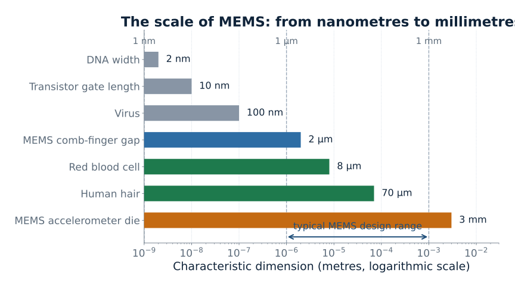{width="94%"}

::: {.notes}
Point out that a MEMS accelerometer die is millimetres across, but its critical
features (comb gaps, beam thickness) are micrometres. Both scales matter.
:::

## MEMS device families

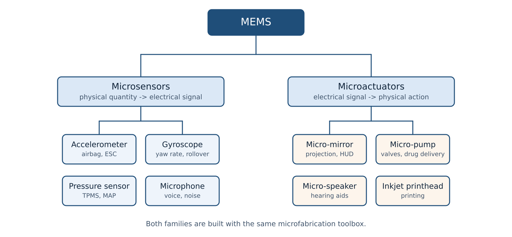{width="92%"}

::: {.notes}
Ask the class to classify each example as sensor or actuator before you reveal the
branch. Note that some devices (micro-mirrors) are actuators and that the same
process can build both.
:::

## How MEMS are made

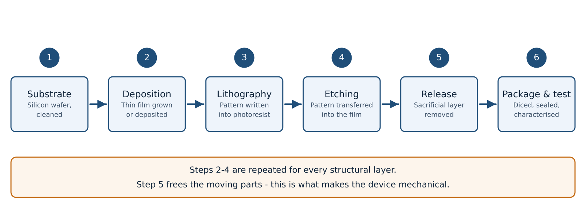{width="96%"}

::: {.notes}
Walk through one cycle slowly. The key conceptual point is that patterning is done
by light (lithography), not by mechanical machining. Steps 2-4 are repeated to build
layers; step 5 removes the sacrificial material so parts can move.
:::

## Bulk versus surface micromachining

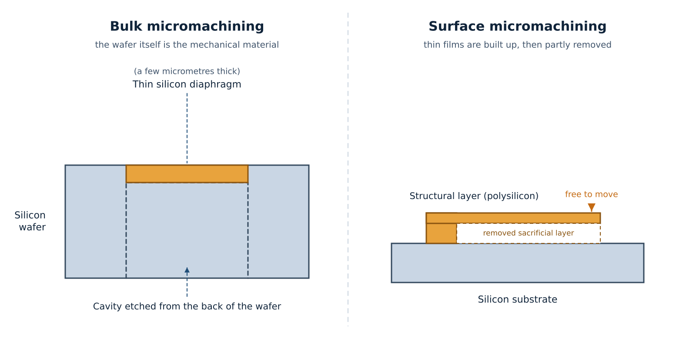{width="96%"}

- **Bulk** — the wafer itself is etched to create membranes, cavities and channels

- **Surface** — thin films are deposited and patterned on top; a sacrificial layer
  is removed to release free-standing structures

::: {.notes}
Ask: which approach gives a thicker, more robust proof mass? (Bulk.)
Which allows more complex multi-layer structures and easier integration with
circuitry? (Surface.)
:::

## How MEMS sense — three principles

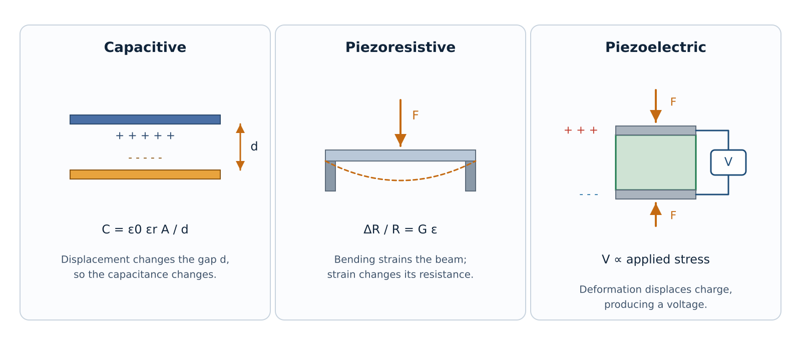{width="96%"}

::: {.notes}
Capacitive: displacement changes a gap, so charge storage changes; needs AC
excitation and careful stray-capacitance control. Piezoresistive: strain changes
resistance; simple but temperature sensitive. Piezoelectric: deformation generates
charge; self-generating but only responds to changing loads.
:::

## Worked example — capacitive accelerometer

**Given** — sensing area $A = 1.0\ \text{mm}^2$, rest gap $d_0 = 2.0\ \mu\text{m}$,
air permittivity $\varepsilon_0 = 8.854\times10^{-12}\ \text{F/m}$,
proof-mass displacement $x = 0.2\ \mu\text{m}$

**Required** — the differential capacitance change $\Delta C$

**Method** — a differential pair of plates: one gap increases, the other decreases

$$
C_1=\frac{\varepsilon_0 A}{d_0-x}, \qquad
C_2=\frac{\varepsilon_0 A}{d_0+x}, \qquad
\Delta C = C_1-C_2
$$

. . .

**Substitution** — with $u = x/d_0 = 0.1$:

$$
C_0=\frac{\varepsilon_0 A}{d_0}=4.43\ \text{pF},
\qquad
\Delta C = \frac{2C_0u}{1-u^2} = 0.89\ \text{pF}
$$

. . .

**Interpretation** — a 0.2 µm movement produces about 0.9 pF, roughly **20 %** of the
rest capacitance and easily measured. The differential arrangement cancels
common-mode effects and stays almost linear.

::: {.notes}
Do the arithmetic live: C0 = 8.854e-12 × 1e-6 / 2e-6 = 4.43 pF.
Then ΔC = 2 × 4.43 pF × 0.1 / 0.99 = 0.89 pF.
Emphasise how small the numbers are — pF-level signals are why on-chip
conditioning is essential.
:::

## Non-linearity and the differential trick

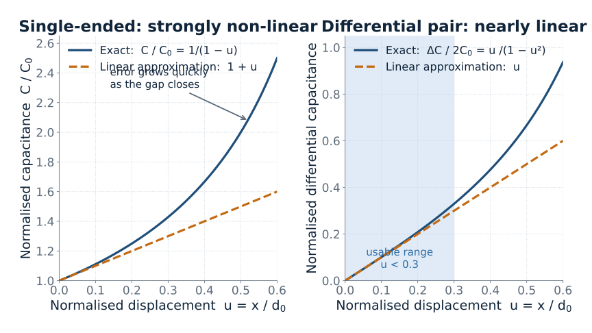{width="94%"}

::: {.notes}
The single-ended curve diverges quickly; the differential pair stays within about
10 % of a straight line up to u ≈ 0.3. This is a textbook example of how device
geometry, not electronics, buys linearity.
:::

## Why MEMS? Strengths and limits

| Strengths | Limitations |
|:----------|:------------|
| Very small and light | Very small signals need careful conditioning |
| Low cost in high volume (batch fabrication) | Packaging is often a large share of the cost |
| Low power consumption | Surface forces (stiction) dominate at this scale |
| High sensitivity and fast response | Temperature and mechanical-stress sensitivity |
| Can be co-integrated with electronic circuits | Limited foundry access and design tools |

::: {.notes}
The packaging point surprises students. A MEMS die may cost cents, but the sealed
package that protects it while still letting it sense can cost much more.
:::

## MEMS in the vehicle

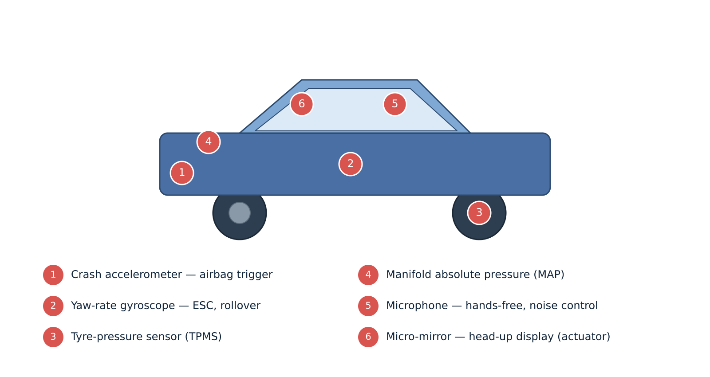{width="82%"}

::: {.notes}
Ask which of these are safety-critical and what redundancy they need.
The airbag accelerometer is a good example of a device that must be self-testing.
:::

## Part 2 — Smart and intelligent sensors

*Section 5.2: from a raw sensing element to a decision-making device*

## From sensing element to intelligent sensor

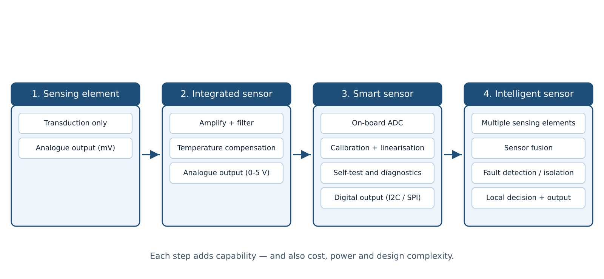{width="96%"}

::: {.notes}
Point out that the *sensing element is the same* across all four stages. Everything
added is signal processing, calibration data and communication.
:::

## Smart sensor architecture

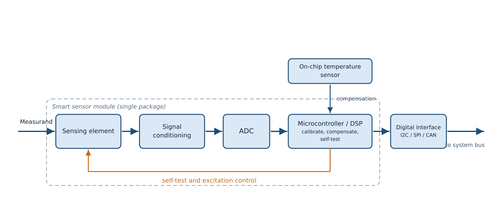{width="94%"}

::: {.notes}
Walk left to right. Highlight the temperature-sensor input for compensation and the
self-test feedback loop to the sensing element. Both are what separate a smart
sensor from a simple sensor-plus-ADC.
:::

## What makes a sensor "smart"?

- Integrated **signal conditioning** — amplification, filtering, impedance matching

- On-board **analogue-to-digital conversion** and a digital output

- A **microcontroller** that performs calibration, linearisation and
  temperature compensation

- **Self-test** and basic diagnostics

- A standard **digital interface** (I²C, SPI, CAN), often with a unique identifier

- Configurable ranges, thresholds and alarms

::: {.notes}
The unifying idea: a smart sensor delivers *clean, trustworthy data* in a form the
rest of the system can use directly, without external electronics.
:::

## What makes a sensor "intelligent"?

- It goes beyond clean data and produces **information**

- **Multi-sensor fusion** — combining accelerometer, gyroscope and magnetometer

- **Fault detection and isolation**, drift correction, plausibility checks

- **Adaptive** behaviour and pattern recognition

- **Local decision making** (edge processing) that reduces bus traffic and latency

> The boundary between "smart" and "intelligent" is not standardised —
> always define your terms in a specification.

::: {.notes}
Warn students that vendors use these labels loosely. The defensible distinction is
the level of processing and decision authority, not the marketing term.
:::

## Sensor fusion — why more than one sensor?

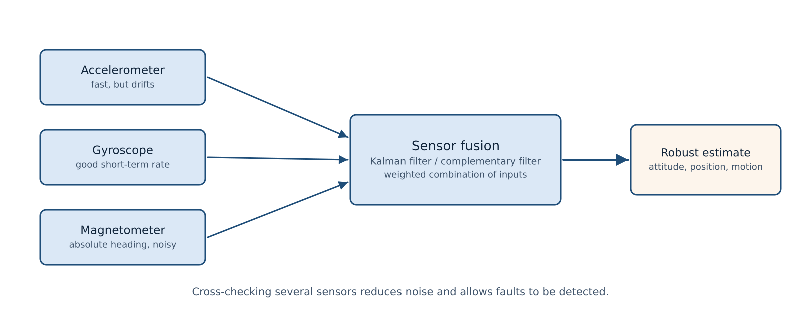{width="88%"}

::: {.notes}
Use the attitude example: a gyroscope is accurate over short times but drifts;
an accelerometer is noisy but does not drift; a magnetometer gives absolute heading
but is disturbed by nearby currents and metal. Fusion uses each where it is strong.
:::

## Basic, smart and intelligent sensors

| Aspect | Basic sensor | Smart sensor | Intelligent sensor |
|:--|:--|:--|:--|
| Output | Analogue (mV) | Digital (I²C, SPI) | Digital + interpreted information |
| Signal conditioning | External | On board | On board |
| Calibration | Manual, external | Stored in the device | Self-calibrating, adaptive |
| Diagnostics | None | Self-test | Fault detection and isolation |
| Inputs | One measurand | One measurand | Several, combined by fusion |
| Decision making | None | Thresholds and alarms | Classification and local decisions |

::: {.notes}
Ask the class to place a phone's touchscreen force sensor, a digital temperature
probe and an autonomous-vehicle inertial unit in this table.
:::

## Worked example — on-board calibration

**Given** — a pressure sensor with a nominal 0–4.00 V output over 0–100 kPa,
but a repeatable "bow" error of up to ±5 % of full scale

**Required** — the residual error after on-board calibration

**Method** — during production test the microcontroller measures the error curve
and stores a correction polynomial

$$
V_{\text{corr}} = a + b\,V_{\text{raw}} + c\,V_{\text{raw}}^{2}
$$

. . .

**Result** — residual error falls from **±5 % FS** to **< 0.2 % FS**

. . .

**Interpretation** — the sensing element has not changed. The improvement comes
entirely from stored calibration data plus computation. That is exactly the value
a "smart" sensor adds.

::: {.notes}
Stress that the error curve must be *repeatable* for this to work. Random noise
cannot be calibrated out; it must be filtered or averaged.
:::

## Calibration and linearisation in practice

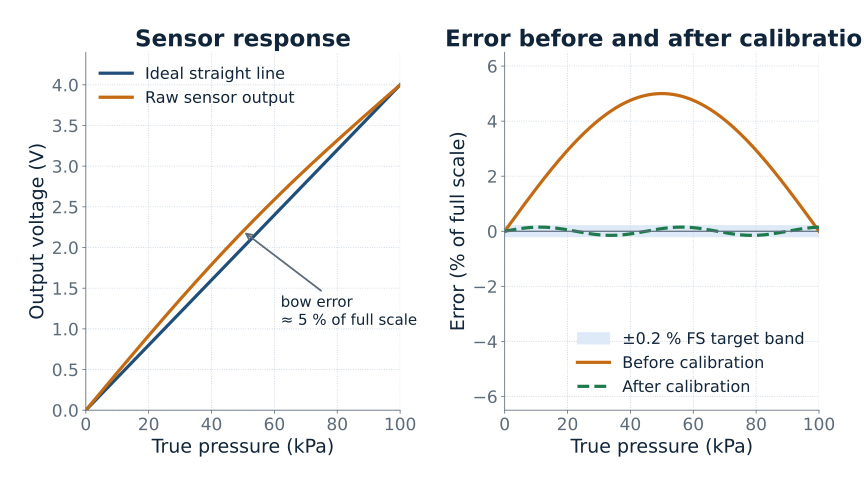{width="94%"}

::: {.notes}
Left: a modest bow error is barely visible on a full-scale plot — which is why
engineers always plot error in % FS. Right: after calibration the error sits inside
the ±0.2 % FS band.
:::

## Animation — from raw signal to usable data

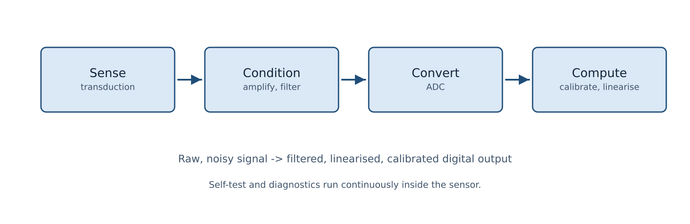{width="88%"}

::: {.notes}
Narrate the signal chain: sense, condition, convert, compute. The noisy trace is
what the sensing element really produces; the clean trace is what the rest of the
system receives. Nothing about the physical transducer changed.

If Manim was installed when `python lecture.py` was run, an optional short
animation is also saved as `figures/smart_sensor_pipeline.mp4`. To use it in place
of the static figure, replace the image line above with
`{width="78%"}`. Quarto Reveal.js renders an
.mp4 referenced this way as a video player.
:::

## Applications beyond the car

- **Consumer** — orientation, step counting, image stabilisation, barometric altitude

- **Medical** — lab-on-chip analysis, disposable pressure sensors, drug delivery pumps

- **Industrial** — vibration monitoring and predictive maintenance, flow and pressure

- **Aerospace** — inertial navigation, structural health monitoring

::: {.notes}
Pick one example and ask what would change if the sensor were "dumb": how much
extra wiring, electronics and calibration effort would move to the system level?
:::

## Common misconceptions

- **"MEMS are just tiny versions of normal machines."**
  At this scale surface forces, stiction and damping dominate — scaling laws change behaviour

- **"A smart sensor is just a sensor with a digital output."**
  Smart means on-board conditioning, calibration and diagnostics, not just a bus

- **"Intelligence requires more hardware."**
  Often it is algorithms plus stored calibration data, not extra silicon

- **"MEMS are always the better choice."**
  Packaging, calibration effort and reliability must be traded against size and cost

- **"An intelligent sensor must use machine learning."**
  Simple fusion and plausibility checks already count as intelligent behaviour

::: {.notes}
The first misconception is the most important. Give the classic example: a
micro-mirror can be held in place by electrostatic attraction that would be
negligible at macro scale, while its own weight is almost irrelevant.
:::

## Conceptual questions

1. Why does a **differential** capacitive arrangement improve linearity compared
   with a single-ended one?

2. A sensor has a digital I²C output but no on-board processing.
   Is it a smart sensor? Justify your answer.

3. Give one situation where **sensor fusion** beats a single, more accurate sensor.

4. Why is **packaging** such a large fraction of MEMS cost?

5. When would you deliberately choose **not** to put intelligence at the sensor node?

::: {.notes}
Question 5 is the most open. Good answers mention power budget, harsh environment,
cost per node, cybersecurity, and the difficulty of updating firmware in the field.
:::

## Summary

- **MEMS** are micro-scale sensors and actuators made by batch microfabrication

- Critical dimensions span roughly **1 µm to 1 mm**; the wafer or thin films
  provide the mechanical material (**bulk** vs **surface** micromachining)

- The dominant transduction principles are **capacitive**, **piezoresistive**
  and **piezoelectric**

- A **smart sensor** adds conditioning, conversion, calibration, self-test and a
  digital interface

- An **intelligent sensor** adds fusion, diagnostics and local decisions

- The engineering value is increasingly in the **processing**, not the transducer

## References

- Senturia, S. D. *Microsystem Design*. Kluwer Academic Publishers.

- Madou, M. J. *Fundamentals of Microfabrication and Nanotechnology*. CRC Press.

- Gardner, J. W., Varadan, V. K., Awadelkarim, O. O. *Microsensors, MEMS and Smart Devices*. Wiley.

- Frank, R. *Understanding Smart Sensors*. Artech House.

- Fraden, J. *Handbook of Modern Sensors*. Springer.